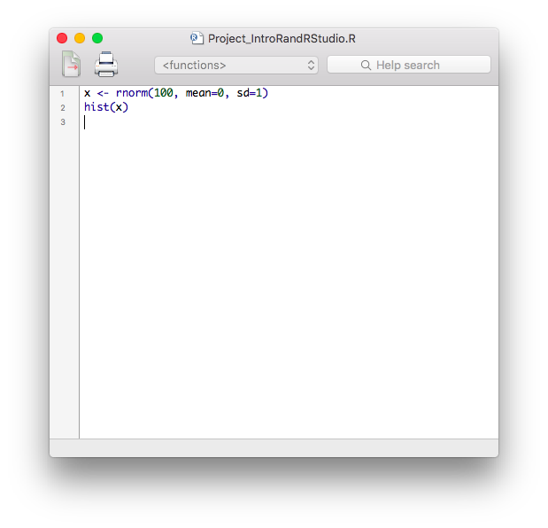
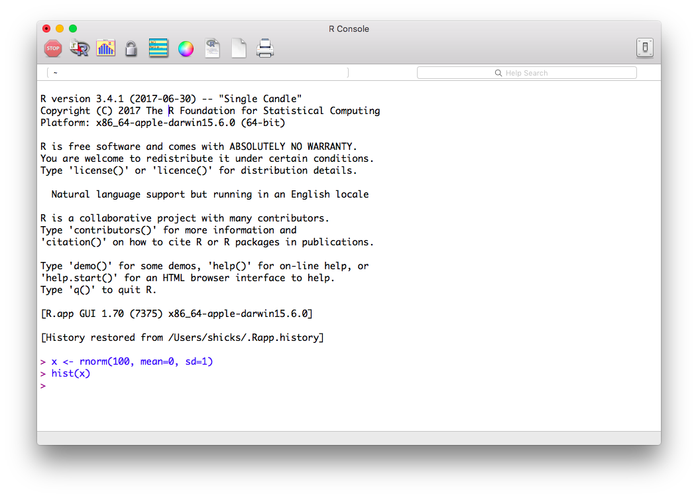
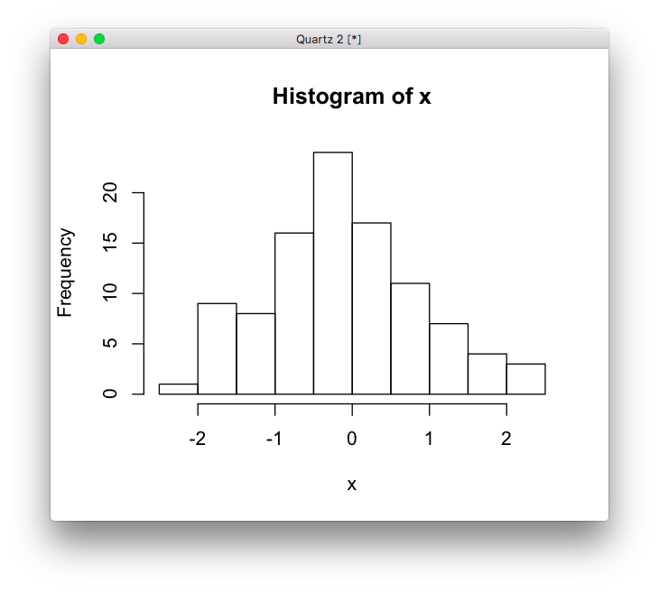
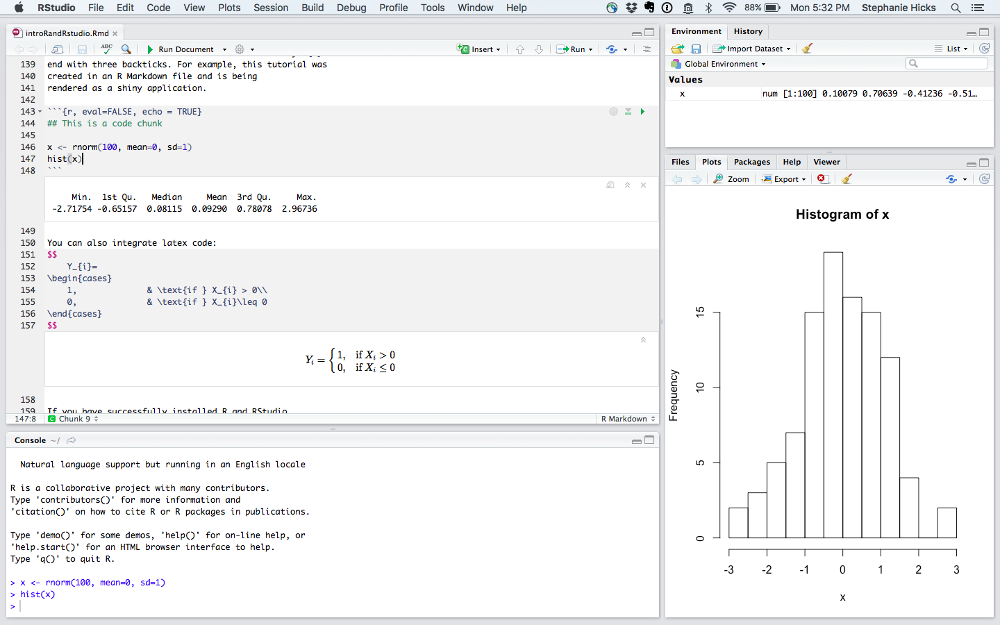

```{r setup, include=FALSE}
library(learnr)
knitr::opts_chunk$set(echo = FALSE)
library(tidyverse)
library(gapminder)
```

## The R programming language


Although R is technically a programming language, it was 
developed specifically for analyzing data. Hence, we
teach R in the context of analyzing data rather than as one 
would teach a programming language. Along the way, we will be 
learning some data analysis concepts.

For anyone with limited programming experience, here are some 
useful R programming courses to help you getting started with R: 

* DataCamp's [R course](https://www.datacamp.com/courses/free-introduction-to-r)
* Coursera's [R Programming course](https://www.coursera.org/learn/r-programming)
* edX's [Introduction to R Programming](https://www.edx.org/course/introduction-r-programming-microsoft-dat204x-0)


### Installing R

The first step is to install R. You can download and install R from
the [Comprehensive R Archive Network](https://cran.r-project.org/)
(CRAN). It is relatively straightforward, but if you need further help
you can try the following resources: 

* [Installing R on Windows](https://github.com/genomicsclass/windows#installing-r) 
* [Installing R on Mac](http://youtu.be/Icawuhf0Yqo)
* [Installing R on Ubuntu](http://cran.r-project.org/bin/linux/ubuntu/README)

### Using R

When you open R, an R console will open: 

```{r out.width = "95%", echo = FALSE}
knitr::include_graphics("images/R-console-empty.png")
```

The console is where you can **write** and **execute** the code. 

Let's try writing some R code. When you type a 
line of code into the console and hit enter 
the command gets *executed*. For example, try typing 2 plus 2
and hit enter:

```{r ex-execution, exercise=TRUE}

```

```{r ex-execution-hint}
2 + 2
```

Instead of writing the code directly into the console, 
typically you write the code in an R script file that 
ends in `.R`. 

Here we are sampling 100 observations from the normal 
distribution with mean 0 and standard deviation of 1, 
assigning it to the letter `x`, and then asking R to create 
a histogram.

```{r out.width = "95%", echo = FALSE}

```

Once you hit enter on the line of code, the code is 
executed in the console. 

```{r out.width = "95%", echo = FALSE}

```

After you execute the code written in the R script file, a third 
window will open to view the plot. 

```{r out.width = "95%", echo = FALSE}

```


### Exercise

Let's interactively sample 100 observations
from a normal distribution with mean of 3 and 
standard deviation of 1 and assign it to `x`. 
Calculate the sample mean of `x`. 

```{r rnorm, exercise=TRUE}

```

```{r rnorm-hint}
x <- rnorm(100, mean=3, sd=1)
mean(x)
```

**Note**: to make assignments in R, we use `<-`. 
We can also use the equal sign `=` although here we try 
to stick to `<-` to make it very clear it is an 
assignment and not logical statement.


## RStudio

```{r out.width = "25%", echo = FALSE}
knitr::include_graphics("https://d21ii91i3y6o6h.cloudfront.net/gallery_images/from_proof/9288/small/1447092155/rstudio-hexbin-sticker-from-rstudio.png")
```

RStudio builds upon R to provide an integrated
development environment (IDE). It includes a console, 
syntax-highlighting editor and tools for plotting, history, 
debugging and workspace management. For this tutorial 
we will use RStudio. 

```{r out.width = "95%", echo = FALSE}

```


### Installing RStudio

The next step is to install [RStudio](https://www.rstudio.com/home/). 
Instructions for Linux and Mac OSX are 
[here](http://www.rstudio.com/products/rstudio/download/) and for
Windows there are special
[instructions](https://github.com/genomicsclass/windows). 


### R Markdown 

You can create different types of files 
in RStudio: For example, you can use `.R` files like before, 
but you can also work with what are called 
[**R Markdown** files](http://rmarkdown.rstudio.com) 
which end in a `.Rmd` file format. 

These are documents that create reproducible reports. 
It integrates narrative text and code together and creates 
elegantly formatted output (including HTML, PDF, MS Word, 
Beamer, shiny applications, and websites). 


The code is written inside of what are called **code chunks**. 
These are defined with three backticks ` ``` ` followed by `{r}` and 
end with three backticks. For example, this tutorial was 
created in an R Markdown file and is being
rendered as a shiny application. 

```{r, eval=FALSE, echo = TRUE}
## This is a code chunk

x <- rnorm(100, mean=0, sd=1)
hist(x)
```


You can also integrate latex code:  
$$
    Y_{i}= 
\begin{cases}
    1,              & \text{if } X_{i} > 0\\
    0,              & \text{if } X_{i}\leq 0
\end{cases}
$$

If you have successfully installed R and RStudio, 
you should be able to follow along with the rest 
of this tutorial by running code yourself.  

For help with learning about Markdown, you can click 
on the **Markdown Quick Reference** in the Help menu in RStudio.  

```{r out.width = "95%", echo = FALSE}
knitr::include_graphics("images/RMarkdown-help.png")
```


## Base R

When you download R from [CRAN](https://cran.r-project.org) 
you get what we call **base** R. This includes several 
**functions** that are considered fundamental for data 
analysis. 

Here is a cheatsheet from RStudio about base R: 


In the next few sections, we'll cover some basics about base R. 

Base R also includes several **example datasets**. 
These datasets are particularly useful as examples 
when we are learning to use the available functions. 
You can see all the available datasets by executing 
the function `data()`:

```{r data-function, exercise=TRUE}
data()
```

Because in R functions are objects, we need the two 
parenthesis to let R know that we want the function 
to be executed as opposed to showing us the code for 
the function. Type `data` and note the difference:

```{r data-obj, exercise=TRUE}
data
```


## Explore a data set in R

To see an example of functions at work, we will use the
`faithful` dataset (Old Faithful Geyser Data). To view any
data set that has been loaded in R, you can just type
the name of the data set. Be careful if you have a 
large data set as this will print all rows and all 
columns in the R console. 

```{r faithful, exercise=TRUE}
faithful
```

We see there are two columns titled `eruptions` and
`waiting` and 272 observations. 

Alternatively, if you want to see just the first 
few rows of the data set, use the `head()` (or `tail()`)
function, which returns the first few (or last) rows. 

```{r faithful-header, exercise=TRUE}
head(faithful)
```

If you want to see a summary of the structure 
(or dimension) of the data set, you can use 
the `str()` (or `dim()`) function. 

```{r faithful-str, exercise=TRUE}
str(faithful)
```
Here we see that this object is a `data.frame`. 
These are one of the most widely used data types in R. 
They are particularly useful for storing information 
into table structures


### Extracting elements in a data frame 

To extract specific elements in a `data.frame`
in R, we can use the `[` and `]` symbols with a comma 
inbetween: 


```{r faithful-extract-elements, exercise=TRUE}
## extract element in 5th row and 2nd column
faithful[5,2]

## extract element in 10th row and 1st column
faithful[10,1]
```


### Extracting entire columns

There are two ways to extract an entire column 
from a `data.frame`. 

The first way is to use the `[` and `]` symbols: 
```{r faithful-extract-columns, exercise=TRUE}
faithful[,1]
```

Note, we do not write a number before the comma, 
which tells R to return all the rows in the 
first column. This returns a vector.  

Alternatively, to extract columns by specifying the 
name of the column in the `data.frame` we use 
the `$` character like this:

```{r, faithful-dollarsign, exercise=TRUE}
faithful$eruptions
```
This also returns a vector. 

To return a list of the column names, we use the 
`colnames()` function:
```{r faithful-colnames, exercise=TRUE}
colnames(faithful)
```

Finally, we access elements from a 
vector using the `[` and `]` symbols:

```{r faithful-colnames-element, exercise=TRUE}
faithful$eruptions[2]
```


## Vectors

**Vectors** in R are a sequence of data elements of the same type. 
Many of the operations used to analyze data are applied to vectors. 
In R vectors can be numeric, characters or logical. 

The most basic way to create a vector is with the function `c()`:
```{r vectors, exercise=TRUE}
x <- c(2, 4, 6)
x
```

Two other common ways of generating vectors are 
using `:` (called the colon operator) or 
the `seq()` function:

```{r vectors-colon, exercise=TRUE}
x <- 1:5
x

x <- seq(1,5, by = 0.5)
x
```

Vectors can be repeated using the `rep()` function: 

```{r vectors-names, exercise=TRUE}
x <- rep(1:3, each=5)
x
```

There are some basic vector functions too such as
`table()`, `unique()`, `sort()`

```{r vectors-functions, exercise=TRUE}
x <- rep(20:25, each=5)
str(x)
```


### Coercion

Vectors need to be homogenous. But when R is instructed to 
create a vector of different types, it does not give an error. 
Instead it tries to **coerce** values to be the same. 
Here is an example of coercing a list of numbers 
(heights in inches) with a character string (height in 
feet and inches):

```{r coercion, exercise=TRUE}
height <- c(60, 59, 55, "5'5", 70)
str(height)
```

Note that no warning or error was given. It simply changed 
everything to a character. This is important to know 
because sometimes we make a mistake in entering data 
and receive no error message.


## Basic plots in R

To illustrate the function `plot()` (one of 
the base functions in R), we can plot 
the "eruption time" and "waiting time to 
next eruption" like this:

```{r functions-plot, exercise=TRUE}
plot(x = faithful$eruptions, y = faithful$waiting)
```

### Getting help  in R

A key feature you need to know about R is that you 
can get help for a function using `help` or `?`, like this:
```{r help, echo=TRUE, eval=FALSE}
?plot
help("plot")
```

These pages are quite detailed and also include 
examples at the end. 


### Exercise

Add labels to the x and y axes. Use the help file 
to read about how to do that. 

```{r functions-plot-labels, exercise=TRUE}

```

```{r functions-plot-labels-solution}
plot(x = faithful$eruptions, y = faithful$waiting, 
     xlab = "Eruptions time (minutes)", ylab = "Waiting time to next eruption (minutes)")
```


## Packages in R

Generally speaking, R's base functionality is bare bones. 
In reality, applications of statistics and data analysis
can be quite broad. Therefore, the statistical toolbox 
developed by R developers and users is extensive. Most 
users need only a small fraction of all the available 
functionality. Therefore, a better approach is to make 
specific functionality available **on demand**. 
R does this using **packages**, also called **libraries**. 

To see what packages are loaded when you start R, use 
`sessionInfo()`: 

```{r sessionInfo, exercise=TRUE}
sessionInfo()
```

Some packages are considered popular enough that they are 
included with the base download. For example, the software 
implementing the method of survival analysis are in the 
`survival` package. To bring that those functions in the 
`survival` R package to your current R session we type:

```{r package-survival, exercise=TRUE}
library(survival)
```

However, CRAN has over 11,000 packages that are available 
to be installed. Next, we will learn how to install 
packages not in base R. 

### Installing Packages

To install a package in R, use `install.packages()`. 
R only includes a basic set of functions. It can do much 
more than this, but not everybody needs
everything so we instead make some functions available via
packages. Many of these functions are stored in CRAN where
packages are vetted: they are checked for common errors 
and they must have a dedicated maintainer. There are other 
repositories, some with more vetting, such as 
[Bioconductor](http://www.bioconductor.org), and no vetting, 
such as GitHub. You can easily install CRAN packages 
from within R if you know the name of the packages. 
As an example, we are going to install the package `tidyverse`,
which we use next: 

```{r package-tidyverse-install, eval=FALSE, echo = TRUE}
install.packages("tidyverse")
```

We will learn about the `tidyverse` R package later on today. 
For now, all we need to know is that 
we can then load the package into our R session 
using the `library` function:

```{r, package-tidyverse-load, exercise=TRUE}
library(tidyverse)
```

From now on you will see that we sometimes load 
packages without installing them. This is because 
once you install the package, it remains in place and 
only needs to be loaded with `library`. If you try 
to load a package and get an error, it probably 
means you need to install it first.


## Comments in R
The hash character represents comments, so text following these
characters is not interpreted:

```{r comments, exercise=TRUE}
# This is just a comment
# Note the comment is inside of the three "ticks" on the top and bottom
#    which tell R this is a code chunk. 
# Anything inside of a code chunk be evaulated, unless it is commented out

x <- rgamma(200, shape = 5, scale = 1)
hist(x)

##### You can add as many hash characters as you want. 
```


## Paths and the Working Directory in R

When you are working in R it is useful to know 
your *working directory*. This is the directory 
or folder in which R will save or look for files 
by default. You can see your working directory 
by typing:

```{r working-directory, exercise=TRUE}
getwd()
```

You can also change your working directory using 
the function `setwd()`. Or you can change it 
through RStudio by clicking on "Session" in 
the top menu bar. 

```{r, eval=FALSE, echo =TRUE}
## This changes the working directory to the new path
setwd(‘C://file/path’)

```


The functions that read and write files 
(there are several in R) assume you mean to look 
for files or write files in the working directory. 
Our recommended approach for beginners will have 
you reading and writing to the working directory. 
However, you can also type the 
[full path](http://www.computerhope.com/jargon/a/absopath.htm), 
which will work independently of the working directory.


## Projects in RStudio

The simplest way to organize yourself 
is to [create a Project in RStudio](https://support.rstudio.com/hc/en-us/articles/200526207-Using-Projects).  

This is useful because you can divide your work (or projects)
into their own working directories with its own workspace and history. 

### Creating Projects

You can create a project in a brand new directory or 
in an exisiting directory where you already have R code and data. 

```{r out.width = "65%", echo = FALSE}
knitr::include_graphics("https://baseballwithr.files.wordpress.com/2017/06/package1.png?w=620")
```

```{r out.width = "85%", echo = FALSE}
knitr::include_graphics("http://www.rstudio.com/images/docs/projects_new.png")
```

After you select the project directory location, a new file 
ending in `.Rproj` will be added to the project directory. 
You can then download all your data into this folder. 
Your working directory will be this folder.


### Exercise

In the top menu bar in RStudio, click on "File" and "New Project". 
When creating the project, you will select a folder to 
be associated with it. 


### Working with Projects 

You can open a project in three ways: 

1. Using the **Open Project** command from the File or Project menu. 
2. Selecting project from the most recently opened projects. 
3. Double-clicking on the project file within a folder or finder menu. 

When you open a project, RStudio will: 

- Start a new R session
- Load any data in project's main directory folder
- Load any history in project's main directory folder
- Set the current working directory to the project directory
- Load and source documents to edit code
- Restore any other RStudio settings that were previously saved 
last time the project was edited. 


## Importing data into R

Usually the first step in data analysis is getting 
the data in a form that permits analysis, for example,
importing the data into the R environment. 

Small datasets such as the one used as an
example here are typically stored as Excel files. 
Although there are R packages designed to read Excel 
(`.xls`) format, you generally want to avoid this and 
save files as comma delimited (Comma-Separated
Value/CSV or `.csv`) or tab delimited 
(Tab-Separated Value/TSV/TXT e.g. `.txt`) files. 
These plain-text formats are often easier for 
sharing, as commercial software is not required for 
viewing or working with the data.


### Base functions to read in data into R

The are several functions in base R that are
available for reading data. A Google search of 
"how do I import data into R?" gets us to the 
function `read.table()`. 

```{r,eval=FALSE, echo=TRUE}
?read.table
```

From the help file we see that we need that we need 

> the name of the file which the data are to be read from. Each row of the table appears as one line of the file. If it does not contain an absolute path, the file name is relative to the current working directory, `getwd()`. 

Other base functions to read data into R include `read.csv()` and
`read.delim()`. 

### Two main options to load data using base R

#### Option 1: Download file with your browser to your working directory

You can navigate to the file `ny_airquality.csv` [available online](https://github.com/datasciencelabs/data/blob/master/ny_airquality.csv). 
If you navigate to the file, you need to click on *Raw* on the
upper right hand corner of the data and then use your browser's "Save
As" function to ensure that the downloaded file is in a CSV
format. Some browsers add an extra suffix to your file name by
default. You do not want this. You want your file to be named
`ny_airquality.csv`. 

Once you have this file in your working directory, then you 
can simply read it in like this:

```{r, echo=TRUE, eval=FALSE}
msleep <- read.csv("ny_airquality.csv")
```

If you did not receive any message, then you probably 
read in the file successfully.


#### Option 2: Read file on web from within R 

Many data sets are stored online. You can actually read 
these files directly to your R session in the following way:

```{r, readcsv-direct, exercise=TRUE}
filename <- "https://raw.githubusercontent.com/datasciencelabs/data/master/ny_airquality.csv"
nyair <- read.csv(filename)
```

We also note that we have put the content of what comes out 
of `read.csv` into an *object*. We picked the object name `nyair`. 

#### Option 3: Install R data package from CRAN

Another option is to install an R data package from CRAN. Here we 
will install the [`gapminder` data set](https://cran.r-project.org/web/packages/gapminder/index.html), 
which contains demographic statistics popularized by Hans Rosling's TED talks. 

To install the data package, we use the `install.packages()` function: 

```{r, echo=TRUE, eval=FALSE}
install.packages("gapminder")
```

To load the dataset, we use the `library()` function like before. 
```{r gapminder-load, exercise=TRUE}
library(gapminder)
gapminder
```


## The "Tidyverse"

The [tidyverse](https://www.tidyverse.org) is "an opinionated collection 
of R packages designed for data science. 
All packages share an underlying philosophy and common APIs." 

Another way of putting it is it's a set of packages that are useful 
specifically for data manipulation, exploration and visualization 
with a common philosphy. 

### What is this common philosphy? 

The common philosphy is called "tidy" data. 

In tidy data:

* Each variable forms a column.
* Each observation forms a row.
* Each type of observational unit forms a table.


```{r out.width = "95%", echo = FALSE}
knitr::include_graphics("http://r4ds.had.co.nz/images/tidy-1.png")
```

The table on the right is considered "messy" and the table 
on the left is considered "tidy". 

```{r out.width = "95%", echo = FALSE}
knitr::include_graphics("http://r4ds.had.co.nz/images/tidy-9.png")
```


### What is in the tidyverse? 

We can install and load the set of R packages using the shortcut
`install.packages("tidyverse")` function we demonstrated above. 

When we load the tidyverse package using `library(tidyverse)`, 
there are six core R packages that load:

* [ggplot2](http://ggplot2.tidyverse.org), for data visualisation.
* [dplyr](http://dplyr.tidyverse.org), for data manipulation.
* [tidyr](http://tidyr.tidyverse.org), for data tidying.
* [readr](http://readr.tidyverse.org), for data import.
* [purrr](http://purrr.tidyverse.org), for functional programming.
* [tibble](http://tibble.tidyverse.org), for tibbles, a modern re-imagining of data frames.

These packages are highlighted in bold here: 

```{r out.width = "95%", echo = FALSE}
knitr::include_graphics("https://rviews.rstudio.com/post/2017-06-09-What-is-the-tidyverse_files/tidyverse1.png")
```

Because these packages all share the "tidy" philosphy, 
the data analysis workflow is easier as you move from 
package to package. 

In the last few sections of this tutorial, we will focus on the `dplyr`
R package for transformation of data. 

## The dplyr R package

In the real world, analyzing data rarely involves data that can be 
easily imported ready for analysis. According to Wikipedia:

> Data munging or data wrangling is loosely the process of manually converting or mapping data from one "raw" form into another format that allows for more convenient consumption of the data with the help of semi-automated tools.

R provides incredibly powerful and flexible language for data 
manipulation. However, the syntax is somewhat hard to get used 
to. We will therefore introducing a package that makes the 
syntax much more like the English language. This package is 
`dplyr`. 


### What is dplyr?

[`dplyr`](http://cran.rstudio.com/web/packages/dplyr/vignettes/introduction.html) 
is a powerful R-package to transform and summarize 
tabular data with rows and columns. 

### Why is it useful?

The package contains a set of functions 
(or "verbs") to perform common data manipulation
operations such as filtering for rows, selecting 
specific columns, re-ordering rows, adding new 
columns and summarizing data. 

In addition, `dplyr` contains a useful function to perform another common task 
which is the is the "split-apply-combine" concept.  We will discuss that in a
little bit. 

### How does it compare to using base functions R?

If you are familiar with R, you are probably familiar with base R functions
such as `split()`, `subset()`, `apply()`, `sapply()`, `lapply()`, `tapply()` and 
`aggregate()`. Compared to base functions in R, the functions in `dplyr` are easier 
to work with, are more consistent in the syntax and are targeted for 
data analysis around data frames instead of just vectors. 


### Important `dplyr` verbs to remember

`dplyr` verbs | Description
--- | ---
`select()` | select columns 
`filter()` | filter rows
`arrange()` | re-order or arrange rows
`mutate()` | create new columns
`summarise()` | summarise values
`group_by()` | allows for group operations in the "split-apply-combine" concept


#### `dplyr` verbs in action

The two most basic functions are `select()` and `filter()` which selects 
columns and filters rows, respectively. 

#### Selecting columns using `select()`

Select a set of columns: the year and population

```{r select-1, exercise=TRUE}
select(gapminder, year, pop)
```

In base R, this is equivalent to 
```{r select-2, exercise=TRUE}
gapminder[, c("year", "pop")]
```

`dplyr` is much more powerful though. 
To select all the columns *except* a 
specific column, use the "-" (subtraction) operator 
(also known as negative indexing)

```{r select-3, exercise=TRUE}
select(gapminder, -year)
```

To select a range of columns by name, 
use the ":" (colon) operator

```{r select-4, exercise=TRUE}
select(gapminder, continent:pop)
```

To select all columns that start with the 
character string "sl", use the function `starts_with()`

```{r select-5, exercise=TRUE}
select(gapminder, starts_with("c"))
```

Some additional options to select columns based on a specific criteria include

1. `ends_with()` = Select columns that end with a character string
2. `contains()` = Select columns that contain a character string
3. `matches()` = Select columns that match a regular expression
4. `one_of()` = Select columns names that are from a group of names


#### Selecting rows using `filter()`

Let's say we want to know which countries had the 
largest population **in 2007**?

First, we can filter the rows for years in 2007. 

```{r filter-1, exercise=TRUE}
gapminder2007 <- filter(gapminder, year == 2007)
```

Note: you can use the boolean operators 
(e.g. >, <, >=, <=, !=, %in%) to create the 
logical tests.

For example, if we wanted all the years except for 2007, 

```{r filter-2, exercise=TRUE}
filter(gapminder, year != 2007)
```


#### Pipe operator: %>%

Before we go any futher, let's introduce the 
pipe operator: `%>%`. dplyr imports
this operator from another package (`magrittr` [see help file here](http://cran.r-project.org/web/packages/magrittr/vignettes/magrittr.html)). 
This operator allows you to pipe the output 
from one function to the input of another
function. Instead of nesting functions 
(reading from the inside to the 
outside), the idea of of piping is to 
read the functions from left to right. 

Here's an example you have seen: 
```{r pipe-1, exercise=TRUE}
select(gapminder, year, pop, country)
```

Now in this case, we will pipe the `gapminder` data frame to the function that will 
select three columns (`year`, `pop` and `country`). 
```{r pipe-2, exercise=TRUE}
gapminder %>% 
    select(year, pop, country)
```

**Note** that we did not provide the `gapminder` data 
frame inside the function `select()`.  Rather, we 
piped the data frame as input into the `select()` function. 


#### Arrange or re-order rows using `arrange()`

To arrange (or re-order) rows by a particular 
column such as the population, list the name of 
the column you want to arrange the rows by

```{r arrange-1, exercise=TRUE}
gapminder %>% 
    arrange(pop)
```

Now, we will select three columns from `gapminder`, 
arrange the rows by the population. 
```{r arrange-2, exercise=TRUE}
gapminder %>% 
    select(year, pop, country) %>%
    arrange(pop)
```

If you want to arrange the rows in the `pop` column
in a descending order, use the `desc()` function. 

```{r arrange-3, exercise=TRUE}
gapminder %>% 
    select(year, pop, country) %>%
    arrange(desc(pop))
```

Same as above, except here we filter the rows 
for only year 2007. 

```{r arrange-4, exercise=TRUE}
gapminder %>% 
    select(year, pop, country) %>%
    arrange(desc(pop)) %>%
    filter(year == 2007)
```

Here we see the China, India and the United States 
had the largest populations in 2007. 

Next, let's calculate what is the gdp of each country?

#### Create new columns using `mutate()`

The `mutate()` function will add new columns 
to the data frame. Create a new column called 
`gdp` which is the product of population 
and gdp per captia. 

```{r mutate-1, exercise=TRUE}
gapminder %>% 
    mutate(gdp = pop * gdpPercap)
```


#### Create summaries of the data frame using `summarise()`

The `summarise()` function will create summary
statistics for a given column in the data frame 
such as finding the max. For example, to 
compute the max gdp, 
apply the `max()` function to the column 
`gdp` and call the summary value `max_gdp`. 

```{r summarize-1, exercise=TRUE}
gapminder %>% 
  mutate(gdp = pop * gdpPercap) %>% 
  summarise(max_gdp = max(gdp))
```

There are many other summary statistics you 
could consider such `sd()`, `min()`, `median()`, 
`mean()`, `sum()`, `n()` (returns the length of vector), 
`first()` (returns first value in vector), 
`last()` (returns last value in vector) and 
`n_distinct()` (number of distinct values in vector). 


### Group operations using `group_by()`

The `group_by()` verb is an important function 
in `dplyr`. As we mentioned before it's related to 
concept of "split-apply-combine". We literally 
want to split the data frame by some variable 
(e.g. `country`), apply a function to the individual 
data frames and then combine the output. 

Say we wanted to calculate the max gdp
for each country **and** order the max gdp in a 
descending order. (hint: We expect a set of 
summary statistics for each level in `country`.)

```{r groupby-1, exercise=TRUE}
gapminder %>% 
  mutate(gdp = pop * gdpPercap) %>% 
  group_by(country) %>% 
  summarise(max_gdp = max(gdp)) %>% 
  arrange(desc(max_gdp))
```

